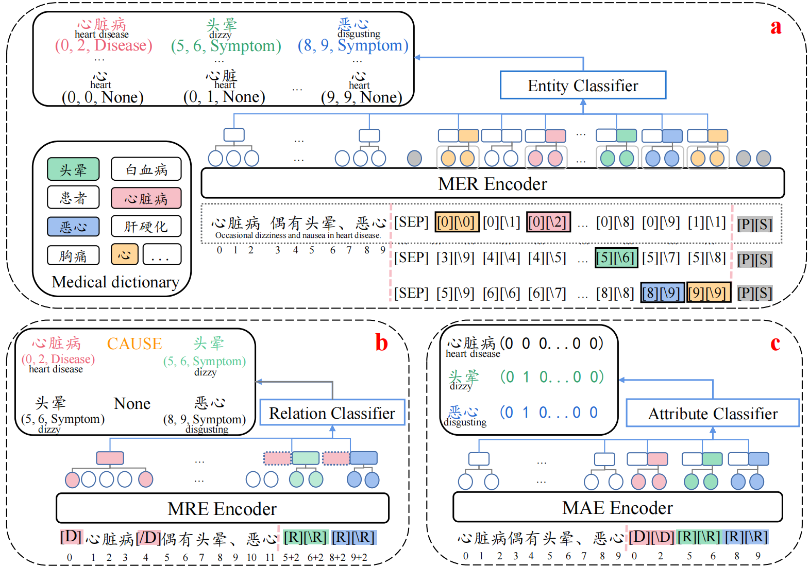

# MAT
We propose Marker LAttice Transformer (MAT), a strong framework for medical IE. This framework is composed of three separate models, each designed for a specific task: medical entity recognition (MER), medical relation extraction (MRE), and medical attribute extraction (MAE). All the models are deeply based on markers embedded in the input text, with which the models compute representations from bottom to top layers.
This allows the representations to encode deep semantic information, leading to better outputs. In addition, we enhance the models by lattice-style incorporation of medical
dictionary information, further pre-training on large-scale EMRs, and auxiliary inputs of medical departments and EMR sections.

## Quick links
* [Overview](#Overview)
* [Setup](#Setup)
  * [Install Dependencies](#Install-dependencies)
  * [Data Preprocessing](#Download-and-preprocess-the-datasets)
  * [Trained Models](#Trained-Models)
* [Training Script](#Training-script)
* [Quick Start](#Quick-start)


## Overview


In this work, Our main contributions can be summarized as follows:

1. We propose MAT, a strong medical IE framework achieving better performance than previous SOTA relation extraction models. This model is a successful application of markers and utilization of medical dictionary in medical IE tasks. We will release our code and collected dictionary to facilitate future research.

2. We train HwaMei-BERT on large-scale EMRs, and show that it can consistently improve the model performance on downstream IE tasks. HwaMei-BERT will also be publicly released.

3. We employ auxiliary information indicators of medical departments and EMR sections, which effectively introduce global context and further contribute to the model performance.


## Setup
### Install Dependencies

The code is based on huggaface's [transformers](https://github.com/huggingface/transformers) and YeDeming's [PL-Marker](https://github.com/thunlp/PL-Marker). Thanks for their insightful work!

Install dependencies and [apex](https://github.com/NVIDIA/apex):
```
pip3 install -r requirement.txt
pip3 install --editable ./transformers
```

### Download and preprocess the datasets
Our experiments are mainly based on [hwamei-500](https://huggingface.co/datasets/FreeJon/hwamei-500) dataset.

In addition, we also conducted experiments on the [CMeEE-V2](https://tianchi.aliyun.com/dataset/177390) and [CCKS-2017](https://www.heywhale.com/mw/dataset/648058405742d97f8f6beca0) datasets.


### Trained Models
We release our pretrained bert-based-hm models on hwamei-datasets on [Hugging face](https://huggingface.co/FreeJon/bert-base-hm-20e-384b-15m)

## Training Script
Download Pre-trained Language Models from [Hugging face](https://huggingface.co/FreeJon/bert-base-hm-20e-384b-15m).

Download Dataset from [hwamei-500](https://huggingface.co/datasets/FreeJon/hwamei-500)

```
└── MAT
    ├── bert_models
    │   └──  bert-base-hm-wwm-20e-384b-15m
    ├── Dataset
    │   └── hwamei500
    ├── scripts
    ...
```

Train MER Models:
```
bash scripts/run_hwameiner_gongkai2.sh
```

Train MRE Models:
```
bash scripts/run_hwameire_gongkai2.sh
```

Train MAE models:
```
bash scripts/run_hwameiae_gongkai2.sh
```

